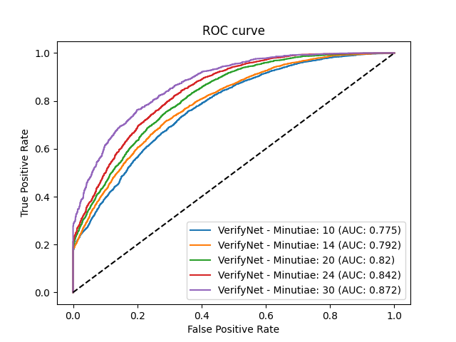

# FingerFlow

[](https://badge.fury.io/py/fingerflow)
[](https://badge.fury.io/py/fingerflow)

FingerFlow is an end-to-end deep learning Python framework for fingerprint minutiae manipulation built on top of [Keras](https://keras.io/) - [TensorFlow](https://www.tensorflow.org/) high-level API.

In current stable version 3.0.1 following modules are provided:

- **extractor** - module responsible for extraction and classification of minutiae points from fingerprints. It is also capable of detecting fingerprint core points.
- **matcher** - module responsible for matching extracted minutiae feature vectors.

## GPU support

FingerFlow supports GPU acceleration on [CUDA®-enabled graphic cards](https://developer.nvidia.com/cuda-gpus).

## Software requirements

- **Python 3.7 or newer**
- **CUDA** - for TensorFlow GPU acceleration (if missing, CPU will be used for computation)

## Installation

Use the package manager [pip](https://pip.pypa.io/en/stable/) to install FingerFlow. We reccomend to use it in **pip** or **anaconda** enviroment.

Installation in anaconda enviroment:

```bash
pip install fingerflow
```

## Modules

### Extractor

Module responsible for extraction and classification of fingerprint minutiae points and also for detecting fingerprint core point.
Minutiae extraction part is built using [MinutiaeNet](https://github.com/luannd/MinutiaeNet) neural network architecture.
Core detection part is built using YOLOv4 object detection neural network architecture.

Extractor contains 3 modules:

- **MinutiaeNet** - module responsible for extracting minutiae points from fingerprint image. Using MinutiaeNet neural network architecture.
- **ClassifyNet** - module responsible for classifying extraced minutiae points. Architecture based on FineNet module of MinutiaeNet.
- **CoreNet** - module responsible for detecting fingerprint core point. YOLOv4 neural network architecture is used.

#### Neural networks models

- **CoarseNet**: [Googledrive](https://drive.google.com/file/d/1alvw_kAyY4sxdzAkGABQR7waux-rgJKm/view?usp=sharing) || [Dropbox](https://www.dropbox.com/s/gppil4wybdjcihy/CoarseNet.h5?dl=0)
- **FineNet**: [Googledrive](https://drive.google.com/file/d/1wdGZKNNDAyN-fajjVKJoiyDtXAvl-4zq/view?usp=sharing) || [Dropbox](https://www.dropbox.com/s/k7q2vs9255jf2dh/FineNet.h5?dl=0)
- **ClassifyNet**: [Googledrive](https://drive.google.com/file/d/1dfQDW8yxjmFPVu0Ddui2voxdngOrU3rc/view?usp=sharing)
- **CoreNet**: [Googledrive](https://drive.google.com/file/d/1v091s0eY4_VOLU9BqDXVSaZcFnA9qJPl/view?usp=sharing)

#### API

#### `Extractor`

Class which provides all functionality for extraction of minutiae points

```python
fingerflow.extractor.Extractor()
```

**Arguments**

- `coarse_net_path` - used for setting path to pretrained model of submodule CoarseNet
- `fine_net_path` - used for setting path to pretrained model of submodule FineNet
- `classify_net_path` - used for setting path to pretrained model of submodule ClassifyNet
- `core_net_path` - used for setting path to pretrained model of submodule CoreNet

**Methods**

- `extract_minutiae(image_data)` - used for extracting minutiae points and detecting of fingerprint core from input image data.
  Method accepts input data in form of 3D matrix (e.g. output of [OpenCV imread function](https://docs.opencv.org/3.4/d4/da8/group__imgcodecs.html#ga288b8b3da0892bd651fce07b3bbd3a56)).
  Method returns object with extracted and detected data in following shape:
- **minutiae** - [Pandas](https://pandas.pydata.org/) DataFrame of extracted and classified minutiae points in following form:
  - **x** - x coordinate of minutiae point
  - **y** - y coordinate of minutiae point
  - **angle** - direction of minutiae point rotation
  - **score** - minutiae point extraction confidence
  - **class** - type of minutiae point. In FingerFlow 1.0.0 we support following minutiae classes:
    - **ending**
    - **bifurcation**
    - **fragment**
    - **enclosure**
    - **crossbar**
    - **other**
- **core** - [Pandas](https://pandas.pydata.org/) DataFrame of deteted fingerprint cores in following form:
  - **x1** - left coordinate of bounding box
  - **y1** - top coordinate of bounding box
  - **x2** - right coordinate of bounding box
  - **y2** - bottom coordinate of bounding box
  - **score** - core detection confidence
  - **w** - width of bounding box
  - **h** - height of bounding box

**Usage**

```python
import cv2
import numpy as np
from fingerflow.extractor import Extractor

extractor = Extractor("coarse_net", "fine_net", "classify_net", "core_net")

image = cv2.imread("some_image")

extracted_minutiae = extractor.extract_minutiae(image)
```

### Matcher

Module responsible for matching extracted feature vectors. It is using custom Siamese neural network architecture.
Input size (number of minutiae in feature vector) for matching is not fixed and is determined by `precision` constructor argument. Used weights need to be in the correct shape - network needs to be trained with the same precision as passed in the argument.
But in general, the more minutiae points the higher precision. Our custom model is trained on 10, 14, 20, 24, 30 minutie points per input.



Matcher contains 1 module:

- **VerifyNet** - module responsible for matching feature vectors. Custom Siamese neural network architecture is used.

#### Neural network models

- **VerifyNet 10**: [Googledrive](https://drive.google.com/file/d/1cEz3oCYS4JCUiZxpU5o8lYesMOVgR0rt/view?usp=sharing)
- **VerifyNet 14**: [Googledrive](https://drive.google.com/file/d/1CI7z1r99AEV6Lrm2bQeGEFmVdQ8colUW/view?usp=sharing)
- **VerifyNet 20**: [Googledrive](https://drive.google.com/file/d/1lP1zDHTa7TemWPluv89ueFWCa95RnLF-/view?usp=sharing)
- **VerifyNet 24**: [Googledrive](https://drive.google.com/file/d/1h2RwuM1-mgiF4dfwslbgiI7-K8F4aw2A/view?usp=sharing)
- **VerifyNet 30**: [Googledrive](https://drive.google.com/file/d/1gQEzJKlCmUqe7Sx-W-6H1w1NGY8M98bX/view?usp=sharing)

#### API

#### `Matcher`

Class which provides all functionality for matching feature vectors

```python
fingerflow.matcher.Matcher()
```

**Arguments**

- `precision` - input size (number of minutiae in feature vector)
- `verify_net_path` - used for setting path to pretrained model of submodule VerifyNet

**Methods**`

- `verify(anchor, sample)` - used for matching feature vectors.
  Method accepts input data in form of [NumPy](https://numpy.org/) N-dimensional array, which should be in following shape: (confidence, columns).
  Its columns should contain the same data as `Extractor minutiae output` with one additional column that represents minutia distance to fingerprint core.
  Method returns float matching confidence in range 0-1.
- `verify_batch(pairs)` - performs pairwise verification in provided list of pairs. Returns list of float matching confidences.
- `plot_model(file_path)` - plot model structure into image file. `file_path` should represent path to desired file.

**Usage**

```python
from fingerflow.matcher import Matcher

matcher = Matcher(30, "verify_net")

prediction = matcher.verify(anchor_feature_vector, sample_feature_vector)
```

## Contributing

Pull requests are welcome. For major changes, please open an issue first to discuss what you would like to change.

## License

[MIT](https://choosealicense.com/licenses/mit/)
